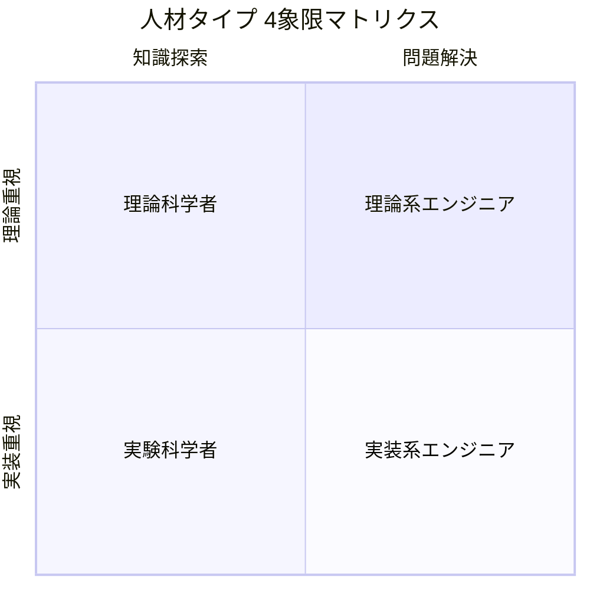

# ガンダムが好きかジムが好きかで語るエンジニア論

## はじめに

あなたは、ガンダムが好きですか、ジムが好きですかと言われたどちらを答えるだろうか。
今の僕ならジムが好きと答える。そこから見えてくるエンジニア像とは何だろうか。

## AI

以下はご指定のテーマに基づく記事の一案です：

---

## 「ガンダムが好きですか、ジムが好きですか」と聞かれたら——エンジニアとしての答えとは？

「あなたは、ガンダムが好きですか、ジムが好きですか？」

アニメ『機動戦士ガンダム』を見たことがある人なら、一度はこう問われた経験があるかもしれない。誰もが憧れるヒーロー機「ガンダム」、それを支える無数の量産機「ジム」。この問いは、単なるロボットの好みを問う以上の意味を持っている。

かつての自分なら迷わず「ガンダム」と答えていただろう。圧倒的な性能、唯一無二の存在感、

しかし、今の僕は違う。今の僕なら、迷わず「ジムが好き」と答える。

なぜだろうか？

### ジムという機体の価値

ジムは地味だ。性能で言えばガンダムに劣る。だが、ジムには“現場のリアル”が詰まっている。

ジムは量産型であり、現場を支える無数の兵士たちが乗り込む機体。スペック上は突出していないが、整備性が高く、パーツの共有化やコストパフォーマンスに優れている。つまり、\*\*現場で機能するために最適化された「道具」\*\*なのだ。

そして、これはエンジニアリングの本質に通じている。

### エンジニアとしての視点

エンジニアとしてキャリアを積んでいくと、次第に「派手さ」よりも「実用性」や「保守性」の重要性が身に染みてくる。理想を追い求めるのも大切だが、実際のプロジェクトでは限られたリソースの中で、いかに安定して動作し、運用しやすい仕組みを作るかが問われる。

ガンダム的な「理想機」を目指すのではなく、\*\*ジム的な「現実解」\*\*を洗練させていくこと。それこそが、信頼されるエンジニアの在り方なのではないだろうか。

### ジムを選ぶという覚悟

「ジムが好き」と言えるようになった自分には、どこか清々しさがある。

それは「妥協」ではない。「現実」と正面から向き合い、最大限に機能するシステムを構築するという覚悟だ。数あるジムの中で、少しでも長く、少しでも強く戦えるように手を入れ、調整し続ける。そんな姿勢が、現場のエンジニアには求められている。

そして、ジムの中にもガンダムになれる“何か”がある。どこかの現場で、職人のような整備士が魂を込めて調整したジムが、ガンダム顔負けの活躍をする。そんな話を聞くたびに、「エンジニアって、いいな」と思うのだ。

---

**あなたは、ガンダムが好きですか、ジムが好きですか？**

この問いに迷いなく「ジム」と答えられるようになったとき、きっとあなたも、ひとりの立派なエンジニアになっている。

## 4象限マトリクスで分けるエンジニアのタイプ

実用性と革新性
性能重視と保守性

|          | 知識探索                 | 問題解決                     |
| -------- | ------------------------ | ---------------------------- |
| 実装重視 | ハッカー（探究型実践者） | 職人（現場型解決者）         |
| 理論重視 | 研究者（理論開拓者）     | アーキテクト（構造的解決者） |

|              | **革新志向** | **実用志向** |
| ------------ | ------------ | ------------ |
| **複雑**     |              |              |
| **シンプル** |              |              |

## ガンダムとジムの違い

## 僕がジムが好きな理由

- 量産である
- 操縦がシンプルで誰にでも扱いやすい
- メンテナンス性が高い

## どちらの特性もあるエンジニア論

エンジニアだから何がどのように使われるかはどうでもいい。ただ、言われた通り、仕様通りに作るだけである。
一方で、エンジニアだから、どのように使われるかを想定し、または提案をすることが、求められる。
どちらも正しく、どちらもエンジニア論である。

エンジニアは動けばいい。中身の仕組みとかどうでもいい。飛行機はどのような理屈で動くかは関係なく、飛行機の理論として飛ぶのであればもんだい。
一方、エンジニアは中身を理解していることが大事であり、どのような仕組みで動きているかを理解することができる。
どちらも正しく、どちらもエンジニア論である。

例えば、100万件のCSVファイルをダウンロードするとなった時、前者は何もん考えずに100万件のCSVをダウンロードするという仕様に基づいて部品として実装するだけである。
もちろん、UI/UXを考えるが、それは操作としての仕様である。実際にユーザーがどのように使うかは意識しない。また、どのように使われても良いようにする。

一方、後者は、実際のユーザーの利用状況を想定する。そもそも100万件のCSVファイルをダウンロードするというのはどのような状況なのかである。
例えば、それをローカルにダウンロードするとしてもExcelで開けるかは微妙だし、開けても分析しようとすれば固まるだろう。
分析なら別の方で試した方が懸命だろう。
他のシステムで利用したいのであれば、別方法を採用した方がいい場合もある。後者は、そこまで考える。
話を聞けば、後者が正しいエンジニアと思うかもしれないが、そうではない。エンジニアは部品として作成することを考えればユーザーがどのように使われるかは気にならない。職人と良いかても通じるだろう。もちろん、職人にも色々なタイプが存在する。
そこで思い出すが、漫画『ワンピース』のトムさんのセリフである。[こちらにもセリフの紹介がある](https://note.com/noahjd/n/nacc33859f216?sub_rt=share_pw)

> 「どんな船でも・・・・造り出すことに”善”も”悪”もねェもんだ・・・・！！この先お前がどんな船を造ろうと構わねェ！！」
>
> 「・・・・だが生み出した船が誰を傷付けようとも！！世界を滅ぼそうとも・・・！！」
>
> 「生みの親だけはそいつを愛さなくちゃならねェ！！！生み出した者がそいつを否定しちゃあならねェ！！！船を責めるな」
>
> 「造った船に！！！男はドンと胸を張れ！！！」

船の職人であるトムさんは誰が乗り、どのような使い方をするかは気にせず、船を造り出すことだけに注力していると言える。
エンジニアに色々なタイプがあるが、前者もこのトムさんのように立派なエンジニアだと言える。
最初に飛行機の例も出したが、純粋なエンジニアは造りたいものだけを造るというのも何ともエンジニアっぽいと思う。
後者はどちらかと言えば、ビジネスや利用者に沿う考えのエンジニアとも言えるだろう。

例えば、テスト機としてのプロタイプ、試作機であればエンジニアの領域と言えるが、それが実験機なら研究者の領域といる。ガンダムの世界では、ムラサメ研究所のようなニュータイプやサイコガンダムなどのは作成するのはエンジニア、技術者かもしれないが、研究者的な発想と言える。もちろん、このような試作や実験などを行うエンジニアはいるだろうが、研究者よりだろう。科学者であれば、よりもっと基礎理論などの研究だろうけど、例えば、ミノフスキー粒子などで、これはエンジニア領域から大きく外れると言えるのではないだろうか。

