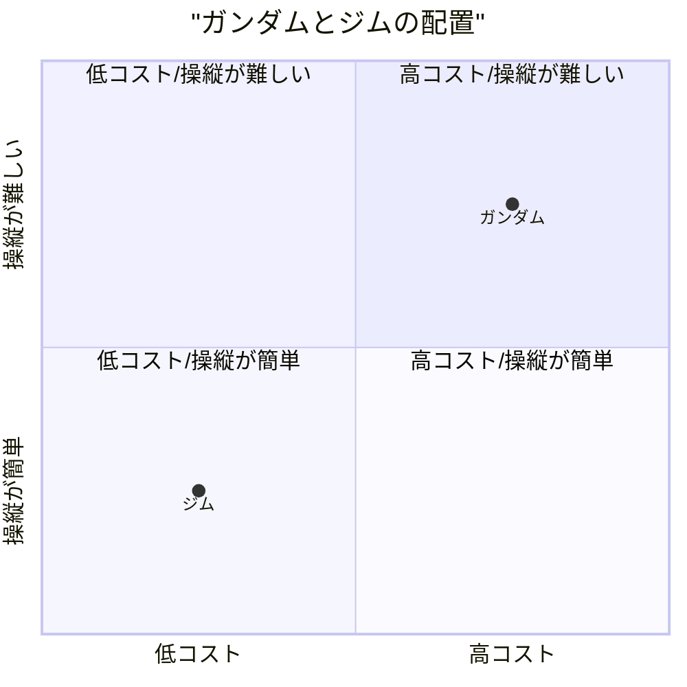

# ガンダムが好きかジムが好きかで語るエンジニア論

## はじめに

ガンダムが好きか、ジムが好きか、そこから見えてくるエンジニア像とは何だろうか。
かつての自分なら「ガンダム」と答えていただろう。しかし、今の僕なら「ジム」と答える。

## ガンダムとジムの違い

### ガンダムとは

ガンダムは最新技術を備えたエースパイロット向けの高性能試作機である。

### ジムとは

一方、ジムはガンダムの技術を基に開発された、操縦系統を簡略化し量産性とコスト削減を重視した一般兵士向けの量産機である。

ジムは地味だ。性能で言えばガンダムに劣る。だが、ジムには"**現場のリアル**"が詰まっている。

 ジムは量産型であり、現場を支える無数の兵士たちが乗り込む機体。スペック上は突出していないが、整備性が高く、パーツの共有化やコストパフォーマンスに優れている。つまり、 **現場で機能するために最適化された兵器** といえる。

### 革新性と実用性で分ける

### コストと操縦性で分ける

### エンジニアの分類

## 一般的な違い

## エンジニアとしての視点

エンジニアとしてキャリアを積んでいくと、次第に「派手さ」よりも「実用性」や「保守性」の重要性が身に染みてくる。理想を追い求めるのも大切だが、実際のプロジェクトでは限られたリソースの中で、いかに安定して動作し、運用しやすい仕組みを作るかが問われる。

ガンダム的な「理想機」を目指すのではなく、 **ジム的な「現実解」** を洗練させていくこと。

## ジムを選ぶという覚悟

「ジムが好き」と言えるようになった自分には、どこか清々しさがある。

それは「妥協」ではない。「現実」と正面から向き合い、最大限に機能するシステムを構築するという覚悟だ。数あるジムの中で、少しでも長く、少しでも強く戦えるように手を入れ、調整し続ける。そんな姿勢が、現場のエンジニアには求められている。

## どちらの特性もあるエンジニア論

エンジニアだから何がどのように使われるかはどうでもいい。ただ、言われた通り、仕様通りに作るだけである。
一方で、エンジニアだから、どのように使われるかを想定し、または提案をすることが、求められる。
どちらも正しく、どちらもエンジニア論である。

エンジニアは動けばいい。中身の仕組みとかどうでもいい。飛行機はどのような理屈で動くかは関係なく、飛行機の理論として飛ぶのであればもんだい。
一方、エンジニアは中身を理解していることが大事であり、どのような仕組みで動きているかを理解することができる。
どちらも正しく、どちらもエンジニア論である。

例えば、100万件のCSVファイルをダウンロードするとなった時、前者は何もん考えずに100万件のCSVをダウンロードするという仕様に基づいて部品として実装するだけである。
もちろん、UI/UXを考えるが、それは操作としての仕様である。実際にユーザーがどのように使うかは意識しない。また、どのように使われても良いようにする。

一方、後者は、実際のユーザーの利用状況を想定する。そもそも100万件のCSVファイルをダウンロードするというのはどのような状況なのかである。
例えば、それをローカルにダウンロードするとしてもExcelで開けるかは微妙だし、開けても分析しようとすれば固まるだろう。
分析なら別の方で試した方が懸命だろう。
他のシステムで利用したいのであれば、別方法を採用した方がいい場合もある。後者は、そこまで考える。
話を聞けば、後者が正しいエンジニアと思うかもしれないが、そうではない。エンジニアは部品として作成することを考えればユーザーがどのように使われるかは気にならない。職人と良いかても通じるだろう。もちろん、職人にも色々なタイプが存在する。
そこで思い出すが、漫画『ワンピース』のトムさんのセリフである。[こちらにもセリフの紹介がある](https://note.com/noahjd/n/nacc33859f216?sub_rt=share_pw)

> 「どんな船でも・・・・造り出すことに”善”も”悪”もねェもんだ・・・・！！この先お前がどんな船を造ろうと構わねェ！！」
>
> 「・・・・だが生み出した船が誰を傷付けようとも！！世界を滅ぼそうとも・・・！！」
>
> 「生みの親だけはそいつを愛さなくちゃならねェ！！！生み出した者がそいつを否定しちゃあならねェ！！！船を責めるな」
>
> 「造った船に！！！男はドンと胸を張れ！！！」

船の職人であるトムさんは誰が乗り、どのような使い方をするかは気にせず、船を造り出すことだけに注力していると言える。
エンジニアに色々なタイプがあるが、前者もこのトムさんのように立派なエンジニアだと言える。
最初に飛行機の例も出したが、純粋なエンジニアは造りたいものだけを造るというのも何ともエンジニアっぽいと思う。
後者はどちらかと言えば、ビジネスや利用者に沿う考えのエンジニアとも言えるだろう。

例えば、テスト機としてのプロタイプ、試作機であればエンジニアの領域と言えるが、それが実験機なら研究者の領域といる。ガンダムの世界では、ムラサメ研究所のようなニュータイプやサイコガンダムなどのは作成するのはエンジニア、技術者かもしれないが、研究者的な発想と言える。もちろん、このような試作や実験などを行うエンジニアはいるだろうが、研究者よりだろう。科学者であれば、よりもっと基礎理論などの研究だろうけど、例えば、ミノフスキー粒子などで、これはエンジニア領域から大きく外れると言えるのではないだろうか。
