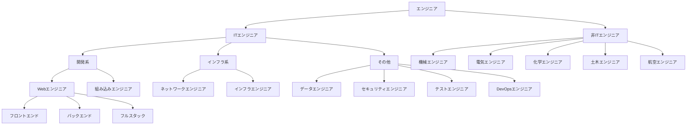
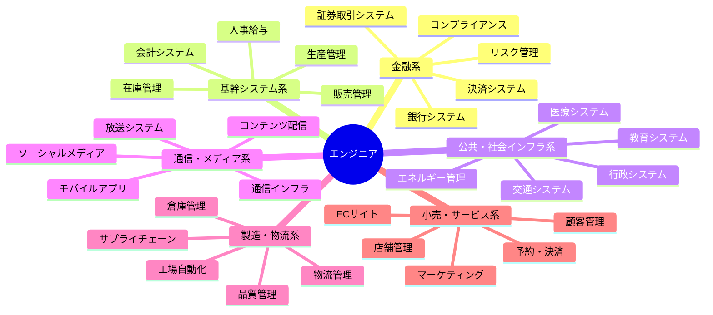
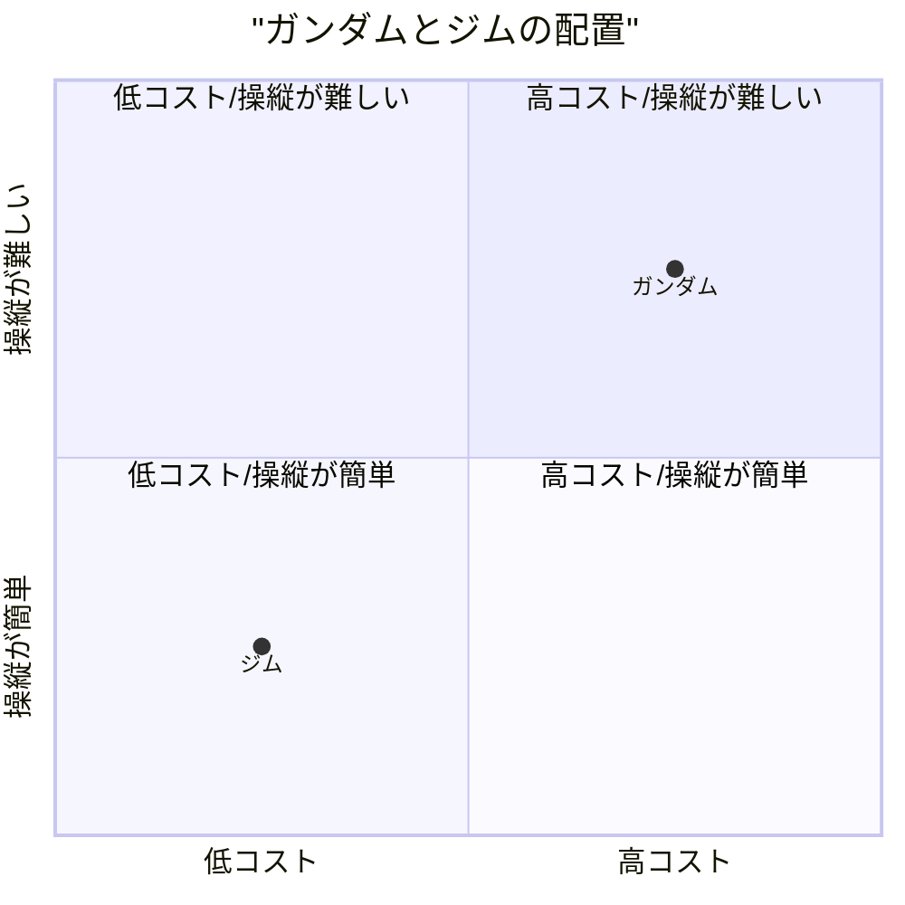

# ガンダムが好きかジムが好きかで語るエンジニア論

## はじめに

### 導入

ガンダムが好きか、ジムが好きか、そこから見えてくるエンジニア像とは何だろうか。
かつての自分なら「ガンダム」と答えていただろう。しかし、今の僕なら「ジム」と答える。

### この記事の目的

この記事では、ガンダムとジムの比較を通じて、エンジニアの多様な側面を考察する。
特に、革新性と実用性のバランス、プロとしての姿勢について深く掘り下げる。

## エンジニアの一般的な分類

### 領域ごとのエンジニアの種類

領域ごとに分けると、特にITエンジニアと非ITエンジニアで分かれる。僕はITエンジニアのため、ITエンジニアを中心に分類している。

### 業務分野による分類

業務ごとの分類は、対象とする顧客や利用者によるものである。図では色分けしているが、同じ色でも内容は大きく異なる場合がある。さらに、業界ごとや会社ごとにルールが大きく異なっており、実際にはさらに細分化されている。例えば、生産管理に関して言えば、卸売業と製造業とでは全く異なる。同じ業界であれば、むしろ異なる業務項目であっても業務知識が共通しており、エンジニアとしては扱いやすい場合もある。例えば、卸売業におけるマーケティング、生産管理、在庫管理の方が、あらゆる生産管理を担当するよりも取り扱いやすい場合もある。

## エンジニアの二つのタイプ

エンジニアは、その特性によって大きく2つのタイプに分類できる。科学者（サイエンティスト）寄りから工学者（エンジニア）寄りまで、様々な特性を持つエンジニアが存在する。数学者と物理学者が異なるように、エンジニアの中にも工学者と技術者という分け方も可能である。

ここでは、特に以下の2つのタイプについて考えてみる：

### Aタイプ

- 仕事として求められている場合に、どのように使われるかを想定し、提案することができる
- ユーザーのニーズやビジネス要件を重視する
- 実用的な解決策を提案できる

### Bタイプ

- 仕様通りに正確に実装することに注力する
- 技術的な完成度を重視する
- ユーザーの使用方法は気にせず、与えられた要件を忠実に実装する

どちらのタイプも正しいエンジニア像であり、それぞれの役割がある。Aタイプはビジネス志向のエンジニアとして理解しやすいため、ここでは主にBタイプについて詳しく見ていく。

### 具体例

「100万件のCSVファイルをダウンロードする」という要望があった場合：

#### Aタイプの対応

- ユーザーの実際の利用状況を想定する
- 100万件のCSVファイルをダウンロードする必要性を確認する
- 以下のような代替案を提案する：
  - Excelでの開封が困難な場合の対処方法
  - データ分析のための別の方法
  - 他のシステムとの連携方法

#### Bタイプの対応

- 仕様通りに100万件のCSVダウンロード機能を実装する
- UI/UXは操作仕様として考慮する
- 実装の正確性と技術的な完成度に注力する
- ユーザーの使用方法は考慮せず、汎用的な実装を行う

### 職人としてのエンジニア

Bタイプのエンジニアは、職人としての側面が強い。漫画『ワンピース』のトムさんの言葉を借りれば：

> 「どんな船でも・・・・造り出すことに"善"も"悪"もねェもんだ・・・・！！この先お前がどんな船を造ろうと構わねェ！！」
>
> 「・・・・だが生み出した船が誰を傷付けようとも！！世界を滅ぼそうとも・・・！！」
>
> 「生みの親だけはそいつを愛さなくちゃならねェ！！！生み出した者がそいつを否定しちゃあならねェ！！！船を責めるな」
>
> 「造った船に！！！男はドンと胸を張れ！！！」

この言葉は、Bタイプのエンジニアの姿勢をよく表している。彼らは、誰がどのように使うかは気にせず、与えられた技術要件に忠実に、最高の品質で実装することに注力する。

特にハードウェアの開発では、この考え方がより明確になる。例えば、モーターの設計では、誰が使うかを想定することは少なく、仕様を満たす部品としての機能性に集中する。エンジニアは「動けばいい」という考え方を持ち、中身の仕組みよりも、与えられた要件を満たすことに重点を置く。

飛行機の例で言えば、飛行機がどのような理屈で飛ぶかは関係なく、理論として飛ぶのであれば問題ないという考え方である。原理の追求は科学者（サイエンティスト）の領域であり、エンジニアは工学的な視点で実装に集中する。

純粋なエンジニアは「造りたいものだけを造る」という職人気質を持ち、Aタイプはビジネスや利用者のニーズに沿った実装を重視する傾向がある。どちらのタイプも、それぞれの役割と価値を持っている。

## ガンダムとジムの比較

### ガンダムとは

ガンダムは最新技術を備えた高性能試作機であり、エースパイロット向けの機体である。

### ジムとは

ジムはガンダムの技術を基に開発された操縦系統を簡略化し量産性とコスト削減を重視した一般兵士向けの量産機である。

### 革新性と実用性で分ける

```mermaid
gantt
    title 革新性 vs 実用性
    dateFormat X
    axisFormat %s

    ガンダム: 0, 0
    ジム: 100, 100
```

ガンダムが、革新性を重視しているのに対し、ジムは実用性を重視している。

### 革新性のガンダム

- 新技術の搭載：ルナチタニウム装甲、ビーム兵器、コア・ブロック・システムなど、革新的技術を多数搭載している
- 高性能AI/OS（例：学習型OS）：パイロットの操作を記録・最適化するなど、戦闘効率を飛躍的に向上させている
- 少数精鋭：1機で戦局を変える能力を思っている

### 実用性のジム

- 量産がし易い：ガンダムの設計を簡素化・コストダウンして大量生産を可能にしている
- 整備が容易：複雑な特殊装備を省いており、戦場での運用・補修がしやすい
- 兵士向け設計：一般兵でも扱える操作系と性能バランスを持っている
- 戦術的柔軟性：武装や装備を任務に応じて柔軟に変更可能である

### コストと操縦性で分ける

ガンダムは、高コストで操縦が難しい機体であるのに対し、ジムは低コストで操縦が容易な機体である。

### 高コスト・高難度のガンダム

- 開発コスト：最新技術の搭載により、開発・製造コストが非常に高い
- 運用コスト：特殊装備の整備やパーツ交換に多額の費用が必要である
- 操縦難度：高性能ゆえに、熟練パイロットでなければ扱いきれない
- 訓練コスト：パイロットの育成に時間と費用がかかる

### 低コスト・高操作性のジム

- 開発コスト：既存技術の応用で、開発・製造コストを抑えている
- 運用コスト：標準装備中心で、整備・運用コストが低い
- 操縦難度：一般兵士でも扱えるよう設計されている
- 訓練コスト：短期間での習熟が可能

## ガンダムとジムで考えるエンジニア論

### エンジニアと研究者の境界

ガンダムがテスト機としてのプロトタイプ、すなわち試作機であればエンジニアの領域と言える。しかし、それが実験機であれば研究者の領域となる。ガンダムの世界では、ムラサメ研究所のような場所でニュータイプ用モビルスーツやサイコガンダムなどを設計・製造するのはエンジニアや技術者かもしれないが、その発想は研究者的と言える。もちろん、このような試作や実験を行うエンジニアも存在するが、活動内容は研究者に近い。科学者であれば、より基礎的な理論や自然科学の研究に従事することになる。たとえば、ミノフスキー粒子の研究などはエンジニアの領域から大きく外れると言える。

### ジムの魅力

エンジニアとしてキャリアを積んでいくと、次第に「派手さ」よりも「実用性」や「保守性」の重要性が身に染みてくる。これはこれまで述べた通り、タイプや仕事内容によって異なる部分もあるが、エンジニアを説明するうえで最もしっくりくるイメージである。
理想を追い求める姿勢も重要であるが、実際のプロジェクトでは限られたリソースの中で、いかに安定して動作し、運用しやすい仕組みを作るかが求められる。ガンダム的な「理想機」を目指すのではなく、**ジム的な「現実解」** を洗練させていく方が理にかなっていると考えるようになる。
ジムは地味である。性能においてはガンダムに劣る。しかし、ジムには**現場のリアル**が詰まっている。これをカッコいいと思うかどうかは人それぞれであるが、少なくとも私はこれをカッコいいと思っている。ジムは量産型であり、現場を支える無数の兵士たちが乗り込む機体である。スペック上は突出していないが、整備性が高くパーツの共有化やコストパフォーマンスに優れている。つまり、**現場で機能するために最適化された兵器**と言える。妥協ではなく、現実解である。

## プロのエンジニアとは

### プロの定義

筆者は、Xでプロのプログラマと敢えて名乗ったことがある。これはプロのエンジニアでも同様である。もちろん、筆者自身もプロのエンジニアの一人である。ここでは趣旨が異なり、さらに話が長くなるため、簡単に触れるに留め、別の機会にプロ論を語りたいと思う。

### プロの多様性

筆者がプロのプログラマやプロのエンジニアと名乗るのは、上記の内容を含んだ意味であり、特に「プロ」という言葉が多岐に渡ることを示したかったためである。プロとは必ずしもアマチュアや素人よりも知識が豊富とは限らない。また、利用者のことを考え、その潜在的な要望までを読み取り実現する人という一面的な定義でもない。つまり、筆者がプロのエンジニアの一人と言うとき、それは簡単には否定できない複雑な意味を持っている。筆者よりも知識があるアマチュアが指摘しても、それは「プロ」の一側面を語っているに過ぎない。

言われたことしかしないのはプロのエンジニアではないという意見もあるが、これも上記で説明した通り、プロのエンジニアの一側面でしかなく、「プロ」の否定にはならない。ここで共通しているのは、単に仕事をしているという意味合いだけである。しかし、筆者の場合は一歩踏み込んだ意味で使用している。例えば、部品を作っているだけだとしても、その部品にこだわりを持ち、限られたリソース（予算、人員、設備）の中でも最低限の水準と仕様を満たした仕事をしているということである。この意味で「ジム」を開発・製造するというのは、プロフェッショナルの意味を含めたプロの仕事であると言える。部品をただ作っているだけのエンジニアも、立派なプロのエンジニアなのである。

### プロとしての姿勢

超優秀なエンジニアが必ずしも求められるわけではない。実際、筆者が参画した現場では、予算や納期などのリソースが制限されていることが普通であり、その範囲内で最低限の仕事をしてくれれば十分である。この最低限というのも難度が低いというわけではない。少なくとも、超優秀、CS保有者、博士、ハッカーレベルを求めているわけではない。それよりも求められるものは数多く存在する。

そもそもフリーランスでなければ、会社に所属しているため、会社員として求められるものがある。例えば、後輩の育成が良い例である。役職があれば当然その役職としての仕事も求められる。フリーランスであってもプロジェクトの一員であれば、メンバーとしての立ち回りの方が重要かもしれない。長くなりそうなので、ここで終わりとする。

## 実践的な考察

### エンジニアの多様性

今回、取り上げていない分類の仕方もある。例えば、アカデミック主義か現場主義（ビジネス）かという分類だ。僕は大学ではないが、高校（基本情報はこの期間に取得している）、専門学校で学んだこともありアカデミック主義的だったが、仕事の期間の方が長くなるにつれ、また会社員（会社の一員）として現場主義になりつつあるという感じだ。

他にも生成AIの活用是非による違いだ。僕は、JavaのWEB+DBであり、Eclipse、MVN、Jenkins、RDBを使っているし、当然、GitやDocker、k8s、Redmineなど色々なツールを使っている。そのため、生成AIを活用するのはその流れのため、違和感なく使っている。エンジニアの中にはサイエンティストタイプ的な全部自分で造らないととか中身を知らないと使い難くない人も多いが、僕はそんなことはない。何ならAIのモデルですら何かは別に気にならない。自分の意図した通りに動いて来ればいいという感じだ。RDBすら信用にならず自分で設計するとかという発想はなく、RDBが既にあるのであれば、それを使えばいいし、Tomcatなどのアプリケーションサーバーを造ろうと思ったことはない。これはWEBプログラマだからかもしれず、ネットワークプログラマだったら別なのかもしれない。ということで、生成AIの活用有無についてもエンジニアごとに千差万別だろう。

## まとめ

### 筆者の立場

今回取り上げたかったのは、エンジニアは多様であると伝えたかったことである。その例えとして、エンジニアでもガンダムが好きか、ジムが好きか分かれるということだ。僕は「ジム」と答えたが、当然、ガンダムも好きだし、もっと特徴ある、ロマンのあるサイコガンダムとかも当然好きであるし、全部自分で造れるのであれば作りたい、中身を知りたいというのも当然ある。嫌いなエンジニアはそれこそ特殊だろう。だが、今回はあえて、「ジム」が好きという思いから書いてみた。
