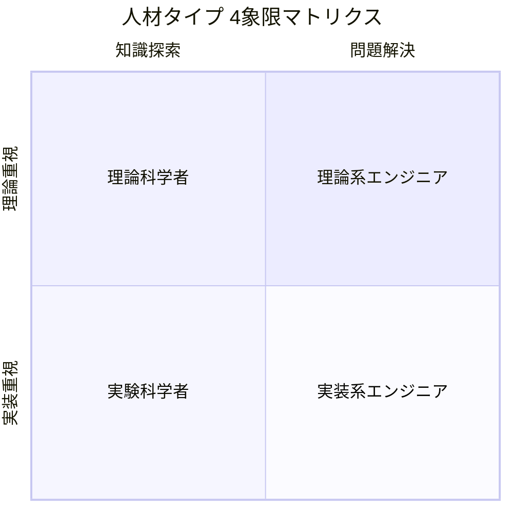

# ガンダムが好きかジムが好きかで語るエンジニア論

## はじめに

あなたは、ガンダムが好きですか、ジムが好きですかと言われたどちらを答えるだろうか。
今の僕ならジムが好きと答える。そこから見えてくるエンジニア像とは何だろうか。

## 4象限マトリクスで分けるエンジニアのタイプ

|          | 知識探索                 | 問題解決                     |
| -------- | ------------------------ | ---------------------------- |
| 実装重視 | ハッカー（探究型実践者） | 職人（現場型解決者）         |
| 理論重視 | 研究者（理論開拓者）     | アーキテクト（構造的解決者） |

|              | **革新志向** | **実用志向** |
| ------------ | ------------ | ------------ |
| **複雑**     |              |              |
| **シンプル** |              |              |

## ガンダムとジムの違い

## 僕がジムが好きな理由

- 量産である
- 操縦がシンプルで誰にでも扱いやすい
- メンテナンス性が高い

## どちらの特性もあるエンジニア論

エンジニアだから何がどのように使われるかはどうでもいい。ただ、言われた通り、仕様通りに作るだけである。
一方で、エンジニアだから、どのように使われるかを想定し、または提案をすることが、求められる。
どちらも正しく、どちらもエンジニア論である。

エンジニアは動けばいい。中身の仕組みとかどうでもいい。飛行機はどのような理屈で動くかは関係なく、飛行機の理論として飛ぶのであればもんだい。
一方、エンジニアは中身を理解していることが大事であり、どのような仕組みで動きているかを理解することができる。
どちらも正しく、どちらもエンジニア論である。

例えば、100万件のCSVファイルをダウンロードするとなった時、前者は何もん考えずに100万件のCSVをダウンロードするという仕様に基づいて部品として実装するだけである。
もちろん、UI/UXを考えるが、それは操作としての仕様である。実際にユーザーがどのように使うかは意識しない。また、どのように使われても良いようにする。

一方、後者は、実際のユーザーの利用状況を想定する。そもそも100万件のCSVファイルをダウンロードするというのはどのような状況なのかである。
例えば、それをローカルにダウンロードするとしてもExcelで開けるかは微妙だし、開けても分析しようとすれば固まるだろう。
分析なら別の方で試した方が懸命だろう。
他のシステムで利用したいのであれば、別方法を採用した方がいい場合もある。後者は、そこまで考える。
話を聞けば、後者が正しいエンジニアと思うかもしれないが、そうではない。エンジニアは部品として作成することを考えればユーザーがどのように使われるかは気にならない。職人と良いかても通じるだろう。もちろん、職人にも色々なタイプが存在する。
そこで思い出すが、漫画『ワンピース』のトムさんのセリフである。[こちらにもセリフの紹介がある](https://note.com/noahjd/n/nacc33859f216?sub_rt=share_pw)

> 「どんな船でも・・・・造り出すことに”善”も”悪”もねェもんだ・・・・！！この先お前がどんな船を造ろうと構わねェ！！」
>
> 「・・・・だが生み出した船が誰を傷付けようとも！！世界を滅ぼそうとも・・・！！」
>
> 「生みの親だけはそいつを愛さなくちゃならねェ！！！生み出した者がそいつを否定しちゃあならねェ！！！船を責めるな」
>
> 「造った船に！！！男はドンと胸を張れ！！！」

船の職人であるトムさんは誰が乗り、どのような使い方をするかは気にせず、船を造り出すことだけに注力していると言える。
エンジニアに色々なタイプがあるが、前者もこのトムさんのように立派なエンジニアだと言える。
最初に飛行機の例も出したが、純粋なエンジニアは造りたいものだけを造るというのも何ともエンジニアっぽいと思う。
後者はどちらかと言えば、ビジネスや利用者に沿う考えのエンジニアとも言えるだろう。

例えば、テスト機としてのプロタイプ、試作機であればエンジニアの領域と言えるが、それが実験機なら研究者の領域といる。ガンダムの世界では、ムラサメ研究所のようなニュータイプやサイコガンダムなどのは作成するのはエンジニア、技術者かもしれないが、研究者的な発想と言える。もちろん、このような試作や実験などを行うエンジニアはいるだろうが、研究者よりだろう。科学者であれば、よりもっと基礎理論などの研究だろうけど、例えば、ミノフスキー粒子などで、これはエンジニア領域から大きく外れると言えるのではないだろうか。

