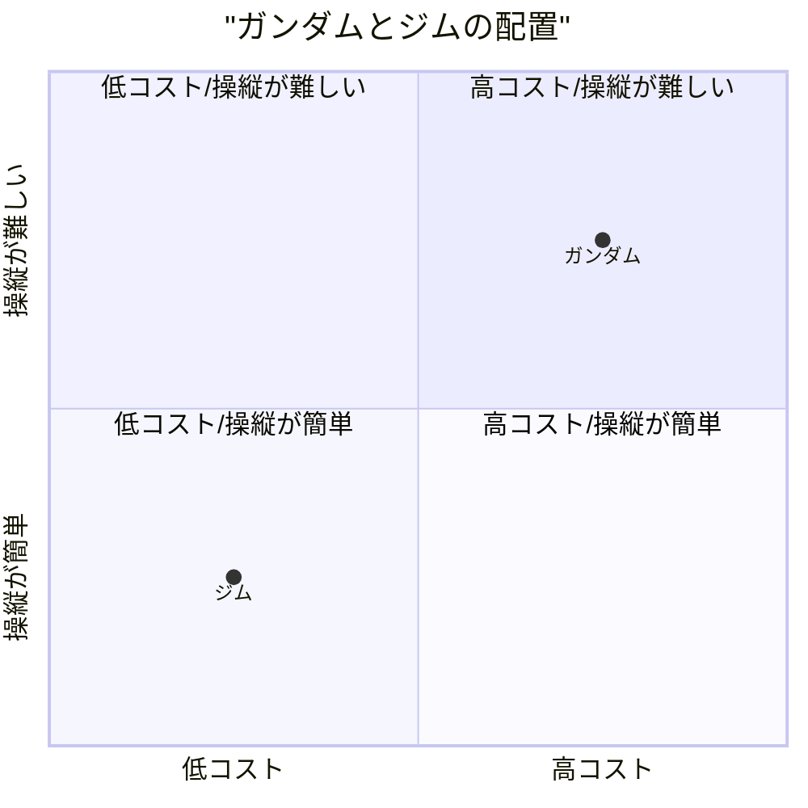
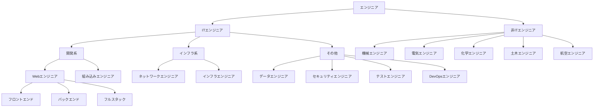
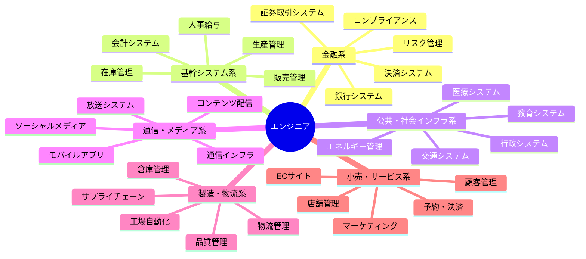

# ガンダムが好きかジムが好きかで語るエンジニア論

## はじめに

ガンダムが好きか、ジムが好きか、そこから見えてくるエンジニア像とは何だろうか。
かつての自分なら「ガンダム」と答えていただろう。しかし、今の僕なら「ジム」と答える。

## ガンダムとジムの違い

### ガンダムとは

ガンダムは最新技術を備えた高性能試作機であり、エースパイロット向けの機体でもある。

### ジムとは

ジムはガンダムの技術を基に開発された操縦系統を簡略化し量産性とコスト削減を重視した一般兵士向けの量産機である。

### 革新性と実用性で分ける

```mermaid
gantt
    title 革新性 vs 実用性
    dateFormat X
    axisFormat %s

    ガンダム: 0, 0
    ジム: 100, 100
```

ガンダムが、革新性を重視しているのに対し、ジムは実用性を重視している。

### 革新性のガンダム

- 新技術の搭載：ルナチタニウム装甲、ビーム兵器、コア・ブロック・システムなど、革新的技術を多数搭載している。
- 高性能AI/OS（例：学習型OS）：パイロットの操作を記録・最適化するなど、戦闘効率を飛躍的に向上させている。
- 少数精鋭：1機で戦局を変える能力を思っている。

### 実用性のジム

- 量産がし易い：ガンダムの設計を簡素化・コストダウンして大量生産を可能にしている。
- 整備が容易：複雑な特殊装備を省いており、戦場での運用・補修がしやすい。
- 兵士向け設計：一般兵でも扱える操作系と性能バランスを持っている。
- 戦術的柔軟性：武装や装備を任務に応じて柔軟に変更可能である。

### コストと操縦性で分ける

ガンダムは、高コストで操縦が難しい機体であるのに対し、ジムは低コストで操縦が容易な機体である。

### 高コスト・高難度のガンダム

- 開発コスト：最新技術の搭載により、開発・製造コストが非常に高い。
- 運用コスト：特殊装備の整備やパーツ交換に多額の費用が必要である。
- 操縦難度：高性能ゆえに、熟練パイロットでなければ扱いきれない。
- 訓練コスト：パイロットの育成に時間と費用がかかる。

### 低コスト・高操作性のジム

- 開発コスト：既存技術の応用で、開発・製造コストを抑えている。
- 運用コスト：標準装備中心で、整備・運用コストが低い。
- 操縦難度：一般兵士でも扱えるよう設計されている。
- 訓練コスト：短期間での習熟が可能。

## エンジニアの一般的な分類

まずは、エンジニアを一般的な分類でまとめまると下記のようになる。

### 領域ごとのエンジニアの種類

領域ごとに分けると、特にITエンジニアと非ITエンジニアで分かれる。僕はITエンジニアのため、ITエンジニアを中心に分類している。

### 業務分野による分類

業務ごとの分類は、対象とするお客さん、利用者ということになる。色で分かれているが、同じ色でも結構違う。さらに業界ごとや会社ごとにルールが全然違ったりと実際はさらに細分化されている。例えば、生産管理で言えば、卸業と製造業では全然違う。同じ業界ならむしろ別の項目でも業務知識が同じでエンジニアとしては扱いやすい場合もあるだろう。例えば、卸業でのマーケティング、生産管理、在庫管理の方が、あらゆる生産管理を担当するよりも扱い安かもしれない。

## どちらの特性もあるエンジニア論

さらに、エンジニアを分類すると特性でも分けることが出来る。例えば、科学者（サイエンティスト）よりとエンジニアそのものの工学者（エンジニア）である。科学者（理系）としても数学者、物理学者では違うだろう。エンジニアでも工学者と技術者という分け方もできるだろう。今回はその違いについては触れないが近い話も含まれていると思う。

ここでは、下記の違いについてを考えてみる。
仕事では、エンジニアだからどのように使われるかを想定するまたは提案をすることが求められる。
ただ、一方でエンジニアだから何がどのように使われるかはどうでもいい。ただ、言われた通り、仕様通りに作るだけである。
僕はどちらの考え方も納得できる。どちらも正しく、どちらもエンジニア論である。

前者は仕事という点を考慮する現実志向のエンジニアとも言え、わざわざ語らなくても理解されるだろうから、ここでは主に後者について語る。

下記の例は現実的でよりエンジニアらしい話である。
100万件のCSVファイルをダウンロードするとなった時、後者は何も考えずに100万件のCSVをダウンロードするという仕様に基づいて部品として実装するだけである。
もちろん、UI/UXを考えるが、それは操作としての仕様である。実際にユーザーがどのように使うかは意識しない。また、どのように使われても良いようにする。

一方、前者は、実際のユーザーの利用状況を想定する。そもそも100万件のCSVファイルをダウンロードするというのはどのような状況なのかである。
例えば、それをローカルにダウンロードするとしてもExcelで開けるかは微妙だし、開けても分析しようとすれば固まるだろう。
分析なら別の方で試した方が懸命だろう。
他のシステムで利用したいのであれば、別方法を採用した方がいい場合もある。前者は、そこまで考える。
話を聞けば、前者が正しいエンジニアと思うかもしれないが、そうではない。エンジニアは部品として作成することを考えればユーザーがどのように使われるかは気にならない。職人と言い換えても通じるだろう。もちろん、職人にも色々なタイプが存在する。
そこで思い出すが、漫画『ワンピース』のトムさんのセリフである。[こちらにもセリフの紹介がある](https://note.com/noahjd/n/nacc33859f216?sub_rt=share_pw)

> 「どんな船でも・・・・造り出すことに"善"も"悪"もねェもんだ・・・・！！この先お前がどんな船を造ろうと構わねェ！！」
>
> 「・・・・だが生み出した船が誰を傷付けようとも！！世界を滅ぼそうとも・・・！！」
>
> 「生みの親だけはそいつを愛さなくちゃならねェ！！！生み出した者がそいつを否定しちゃあならねェ！！！船を責めるな」
>
> 「造った船に！！！男はドンと胸を張れ！！！」

船の職人であるトムさんは誰が乗り、どのような使い方をするかは気にせず、船を造り出すことだけに注力していると言える。
エンジニアに色々なタイプがあるが、前者もこのトムさんのように立派なエンジニアだと言える。
最初に飛行機の例も出したが、純粋なエンジニアは造りたいものだけを造るというのも何ともエンジニアっぽいと思う。
後者はどちらかと言えば、ビジネスや利用者に沿う考えのエンジニアとも言えるだろう。

例えば、テスト機としてのプロタイプ、試作機であればエンジニアの領域と言えるが、それが実験機なら研究者の領域といる。ガンダムの世界では、ムラサメ研究所のようなニュータイプやサイコガンダムなどのは作成するのはエンジニア、技術者かもしれないが、研究者的な発想と言える。もちろん、このような試作や実験などを行うエンジニアはいるだろうが、研究者よりだろう。科学者であれば、よりもっと基礎理論などの研究だろうけど、例えば、ミノフスキー粒子などで、これはエンジニア領域から大きく外れると言えるのではないだろうか。

そうると、下記のように後者を考えることもできる。
特にハードウェアで考えると納得できる部分もある。例えば、モーターを設計、造るときに誰が使うかを想定することはあまりしないからだ。ただ、モーターの仕様を満たしていればそれに見合う場所では部品の一部として機能するからだ。
エンジニアは動けばいい。中身の仕組みとかどうでもいい。飛行機はどのような理屈で動くかは関係なく、飛行機の理論として飛ぶのであれば問題ないという考えだ。飛行機の原理をどこまで追求するかだが、それを本質まで考えるとそれはエンジニアではなく、サイエンティストであるという主張があれば僕は納得するからだ。もちろん、サイエンティストタイプのエンジニアもいるだろうけど、エンジニアであれば自然科学としてではなく、やはり工学的な視点での飛行機の仕組みまでだろう。

## エンジニアとしての視点

エンジニアとしてキャリアを積んでいくと、次第に「派手さ」よりも「実用性」や「保守性」の重要性が身に染みてくる。理想を追い求めるのも大切だが、実際のプロジェクトでは限られたリソースの中で、いかに安定して動作し、運用しやすい仕組みを作るかが問われる。

ガンダム的な「理想機」を目指すのではなく、 **ジム的な「現実解」** を洗練させていくこと。

## ジム

ジムは地味だ。性能で言えばガンダムに劣る。だが、ジムには"**現場のリアル**"が詰まっている。

 ジムは量産型であり、現場を支える無数の兵士たちが乗り込む機体。スペック上は突出していないが、整備性が高く、パーツの共有化やコストパフォーマンスに優れている。つまり、 **現場で機能するために最適化された兵器** といえる。

「ジムが好き」と言えるようになった自分には、どこか清々しさがある。

それは「妥協」ではない。「現実」と正面から向き合い、最大限に機能するシステムを構築するという覚悟だ。数あるジムの中で、少しでも長く、少しでも強く戦えるように手を入れ、調整し続ける。そんな姿勢が、現場のエンジニアには求められている。

## プロのエンジニアとは

僕は、Xでプロのプログラマと敢えて名乗ったことがあるが、これはプロのエンジニアでも同じである。もちろん、僕はプロのエンジニアでもある。僕がプロのプログラマやプロのエンジニアというの以上の内容を含んだ意味で、特にプロと言うのは多岐に渡るということを示したかったからだ。プロと言うのは必ずしもアマチュア、素人よりも知識が豊富とは限らないし、利用者のことを考えその潜在的な要望までを読み取り実現する人と言う一方的なことではなく奥が深いということを示したかったからだ。つまり、僕がプロのエンジニアの一人と言うときは、簡単には否定できないとても複雑な意味になっている。先ほども言ったよりも私よりも知識があるアマチュアがツッコんでもそれは一つの原因として「プロ」を語っているだけだからだ。言われたことしかしないのはプロのエンジニアじゃないというのも上記の説明したとおり、プロのエンジニアとしては一つの原因でしかなく、「プロ」の否定にはならないということだ。ここで共通しているとすれば単に仕事をしているという意味合いだけだろう。だが、私の場合はもう一応一歩踏み込んではいる。例えば、部品を作っているだけだとしてもその部品にこだわりを持っていたり、少ないリソースである、予算、人員、設備の中でも最低限の水準、仕様を満たした仕事をしているということである。そう言った意味で「ジム」を開発、製造するというのは、プロフェッショナルの意味を特に含めてのプロの仕事であることは待ちが無いのと同じく、部品をただ作っているだけのエンジニアもプロのエンジニアだと思っている。
