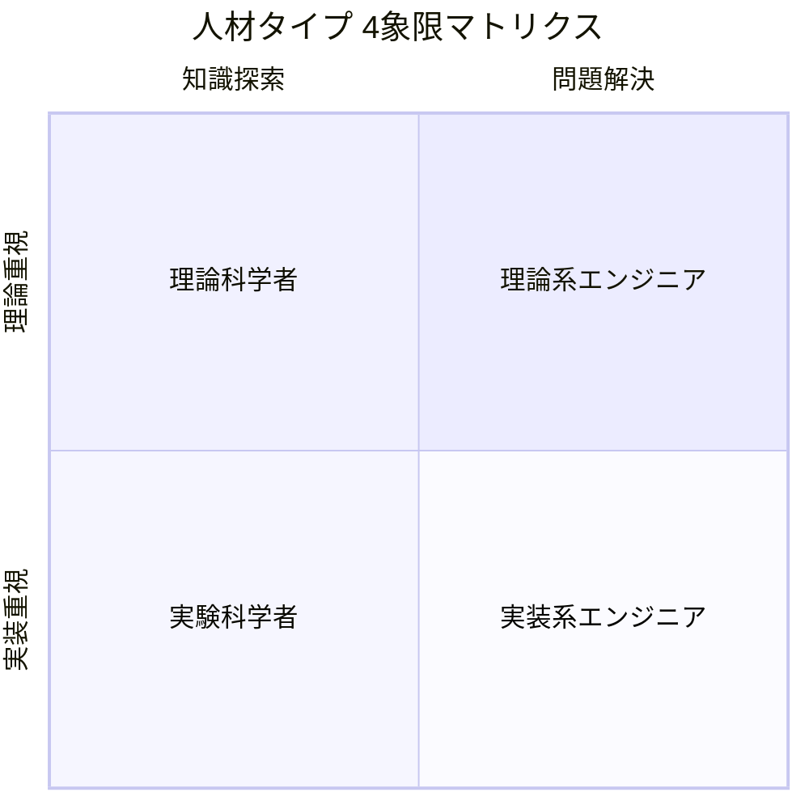

# ガンダムが好きかジムが好きかで語るエンジニア論

## はじめに

あなたは、ガンダムが好きですか、ジムが好きですかと言われたどちらを答えるだろうか。
今の僕ならジムが好きと答える。そこから見えてくるエンジニア像とは何だろうか。

## 4象限マトリクスで分けるエンジニアのタイプ

|          | 知識探索                 | 問題解決                     |
| -------- | ------------------------ | ---------------------------- |
| 実装重視 | ハッカー（探究型実践者） | 職人（現場型解決者）         |
| 理論重視 | 研究者（理論開拓者）     | アーキテクト（構造的解決者） |

|              | **革新志向** | **実用志向** |
| ------------ | ------------ | ------------ |
| **複雑**     |              |              |
| **シンプル** |              |              |

## ガンダムとジムの違い

## 僕がジムが好きな理由

- 量産である
- 操縦がシンプルで誰にでも扱いやすい
- メンテナンス性が高い

## どちらの特性もあるエンジニア論

エンジニアだから何がどのように使われるかはどうでもいい。ただ、言われた通り、仕様通りに作るだけである。
一方で、エンジニアだから、どのように使われるかを想定し、または提案をすることが、求められる。
どちらも正しく、どちらもエンジニア論である。

エンジニアは動けばいい。中身の仕組みとかどうでもいい。飛行機はどのような理屈で動くかは関係なく、飛行機の理論として飛ぶのであればもんだい。
一方、エンジニアは中身を理解していることが大事であり、どのような仕組みで動きているかを理解することができる。
どちらも正しく、どちらもエンジニア論である。
